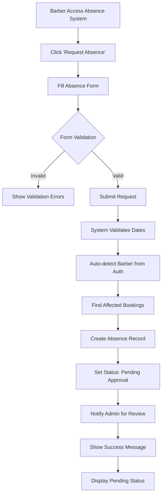
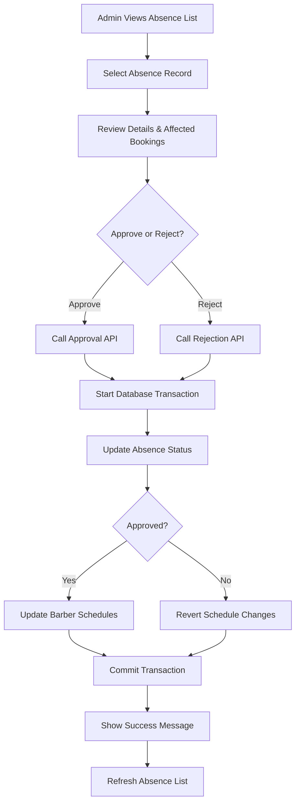
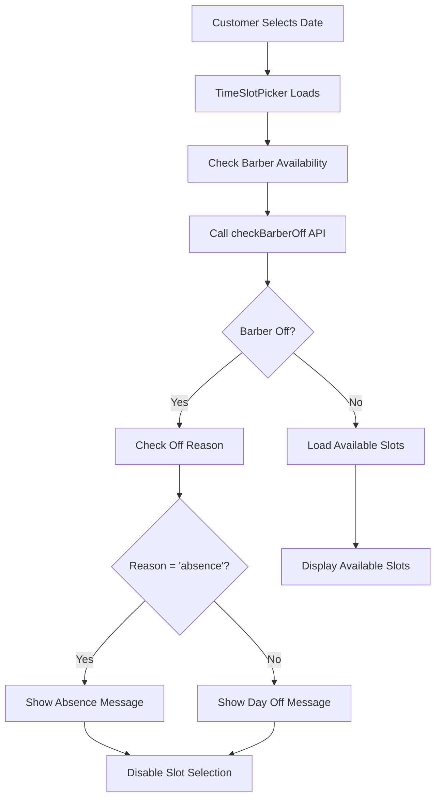
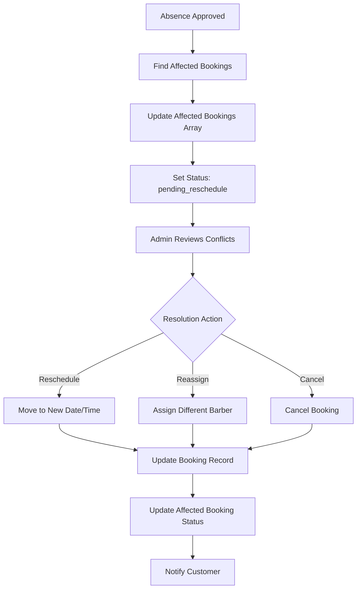

# Barber Absence Management System - Comprehensive Documentation

## 1. System Overview

### Purpose
The Barber Absence Management System is a comprehensive feature within the barbershop booking system that handles barber time-off requests, automates schedule management, and ensures seamless integration with the existing booking workflow. The system prevents booking conflicts during barber absences while maintaining data integrity and providing clear communication to customers.

### Scope
- **Absence Request Management**: Create, approve, reject, and delete absence requests
- **Automatic Schedule Integration**: Seamlessly update barber schedules when absences are approved
- **Booking Conflict Resolution**: Handle existing bookings that conflict with approved absences
- **Frontend Integration**: Prevent new bookings during absence periods with clear user messaging
- **Administrative Oversight**: Comprehensive admin interface for absence management and calendar visualization

### Key Benefits
- **Automated Workflow**: Reduces manual schedule management overhead
- **Data Integrity**: Ensures consistent state between absences and schedules
- **User Experience**: Clear messaging and prevention of invalid booking attempts
- **Conflict Management**: Systematic handling of booking conflicts during absences

## 2. Business Rules

### 2.1 Absence Request Authority
- **Barber Users**: Can create absence requests for themselves
- **Admin Users**: Cannot create absence requests but have full approval/rejection authority
- **Request Creation**: Requires date range, reason, and optional description (barber ID auto-determined from authenticated user)

### 2.2 Approval Workflow
- **Default State**: New absence requests start with `isApproved: false` (pending approval)
- **Admin Approval**: Only designated admin users can approve/reject absence requests
- **Barber Limitations**: Barbers cannot approve their own requests
- **Approval Effects**:
  - Approved absences automatically update barber schedules
  - Rejected absences prevent schedule changes
  - Approval status changes trigger schedule synchronization

### 2.3 Notice Period Requirements
- **Current Implementation**: No minimum notice period enforced
- **Date Validation**: End date must be after start date
- **Overlap Prevention**: System allows overlapping requests (business rule can be enhanced)

### 2.4 Impact on Existing Bookings
- **Conflict Detection**: System identifies bookings that conflict with absence periods
- **Affected Booking Tracking**: Maintains list of impacted bookings with status tracking
- **Resolution Options**: 
  - `pending_reschedule`: Awaiting rescheduling action
  - `rescheduled`: Successfully moved to new time
  - `cancelled`: Booking cancelled due to absence
  - `reassigned`: Moved to different barber

### 2.5 Schedule Blocking Mechanisms
- **Automatic Updates**: Approved absences set `isOffDay = true` for all dates in range
- **Reason Tracking**: Schedule records include `offReason = 'absence'` and `absenceId` reference
- **Slot Management**: All time slots become unavailable during absence periods
- **Reversion**: Schedule changes are automatically reverted if absence is rejected

### 2.6 Conflict Resolution Rules
- **Booking Prevention**: New bookings are blocked during absence periods
- **Existing Booking Handling**: Conflicting bookings are flagged for manual resolution
- **Customer Notification**: Clear messaging explains barber unavailability
- **Alternative Options**: System can suggest other available barbers (future enhancement)

## 3. User Workflows

### 3.1 Barber Creating Absence Request



### 3.2 Admin Reviewing and Approving Absence



### 3.3 System Blocking Time Slots During Absence



### 3.4 Handling Existing Booking Conflicts



## 4. Technical Implementation

### 4.1 Database Models and Relationships

#### BarberAbsence Model (`back-end/models/barber-absence.model.js`)
```javascript
{
  barberId: ObjectId (ref: 'Barber'),           // Required
  startDate: Date,                              // Required
  endDate: Date,                                // Required  
  reason: String,                               // Enum: sick_leave, vacation, emergency, training, personal, other
  description: String,                          // Optional details
  isApproved: Boolean,                          // Default: false
  approvedBy: ObjectId (ref: 'User'),          // Admin who approved
  affectedBookings: [{                          // Conflicting bookings
    bookingId: ObjectId (ref: 'Booking'),
    originalDate: Date,
    newDate: Date,
    status: String,                             // pending_reschedule, rescheduled, cancelled, reassigned
    newBarberId: ObjectId (ref: 'Barber')
  }],
  notificationsSent: Boolean,                   // Default: false
  createdBy: ObjectId (ref: 'User'),           // Required
  timestamps: true
}
```

#### BarberSchedule Integration
```javascript
{
  // Existing fields...
  isOffDay: Boolean,                            // Set to true during absence
  offReason: String,                            // Enhanced enum including 'absence'
  absenceId: ObjectId (ref: 'BarberAbsence'),  // Reference to absence record
  // Other fields...
}
```

### 4.2 API Endpoints and Purposes

#### Core Absence Management
```javascript
// Create absence request (Barber only)
POST /api/barber-absences
Body: { startDate, endDate, reason, description }
Purpose: Barber creates absence request (barberId auto-determined from auth)
Auth: Requires barber role authentication

// Get all absences with filtering (Admin view)
GET /api/barber-absences?barberId=&startDate=&endDate=&reason=&isApproved=&page=&limit=
Purpose: Admin retrieves all absences with comprehensive filtering options
Auth: Requires admin role

// Get barber's own absences (Barber view)
GET /api/barber-absences/my-requests
Purpose: Barber retrieves their own absence requests
Auth: Requires barber role authentication

// Update approval status (Admin only)
PUT /api/barber-absences/:absenceId/approval
Body: { isApproved, approvedBy }
Purpose: Admin approve/reject absence with automatic schedule updates
Auth: Requires admin role

// Reschedule affected bookings
PUT /api/barber-absences/:absenceId/reschedule
Body: { reschedulingOptions }
Purpose: Handle booking conflicts during absence periods

// Delete absence
DELETE /api/barber-absences/:absenceId
Purpose: Remove absence record and revert schedule changes
```

#### Calendar and Schedule Integration
```javascript
// Get barber calendar view
GET /api/barber-absences/calendar?userId=&month=&year=
Purpose: Calendar visualization with absence and booking data

// Get barber schedule
GET /api/barber-absences/:barberId/schedule?month=&year=
Purpose: Detailed schedule view for specific barber

// Check barber availability
GET /api/barber-schedule/is-off?barberId=&date=
Purpose: Real-time availability checking for booking system
```

### 4.3 Frontend Components and Responsibilities

#### BarberScheduleManagement.jsx (Admin Interface)
- **Purpose**: Admin interface for absence approval and management
- **Features**:
  - View and filter all absence requests
  - Approve/reject absence requests
  - Calendar visualization for all barbers
  - Delete absence records
  - Monitor affected bookings
- **Location**: `front-end/src/pages/Admin/BarberScheduleManagement.jsx`

#### BarberAbsenceRequest.jsx (Barber Interface)
- **Purpose**: Barber interface for creating absence requests
- **Features**:
  - Create new absence requests
  - View own absence history
  - Track request status (pending/approved/rejected)
  - Calendar view of own schedule
- **Location**: `front-end/src/pages/barber/BarberAbsenceRequest.jsx` (to be implemented)

#### TimeSlotPicker.jsx Integration
- **Purpose**: Prevent bookings during absence periods
- **Features**:
  - Check barber availability before loading slots
  - Display appropriate messages for absence vs day off
  - Disable slot selection during absences
- **Integration**: Calls `checkBarberOff` API before slot loading

#### BarberCalendarPage.jsx
- **Purpose**: Barber-specific calendar view
- **Features**:
  - Visual absence indicators
  - Booking count display
  - Absence reason information
- **Location**: `front-end/src/pages/barber/BarberCalendarPage.jsx`

#### API Service Layer
- **File**: `front-end/src/services/barberAbsenceApi.js`
- **Functions**:
  - `createBarberAbsence()`: Create absence requests
  - `getAllAbsences()`: Fetch with filtering
  - `updateAbsenceApproval()`: Approve/reject
  - `deleteAbsence()`: Remove records
  - `getBarberCalendar()`: Calendar data
  - `getBarberSchedule()`: Schedule details

### 4.4 Integration with Existing Systems

#### Booking System Integration
- **Conflict Detection**: `findAffectedBookings()` method identifies overlapping bookings
- **Prevention Logic**: `checkBarberOff()` API prevents new bookings during absences
- **Status Updates**: Affected bookings tracked with detailed status information

#### Schedule System Integration
- **Automatic Updates**: `updateBarberSchedules()` method handles schedule modifications
- **Atomic Operations**: Database transactions ensure data consistency
- **Reversion Logic**: `revertBarberSchedules()` undoes changes when needed

#### User Interface Integration
- **Toast Notifications**: Clear messaging for absence-related booking restrictions
- **Calendar Visualization**: Absence periods clearly marked in calendar views
- **Form Validation**: Comprehensive client and server-side validation

## 5. Edge Cases and Error Handling

### 5.1 Overlapping Absence Requests
**Scenario**: Multiple absence requests for the same barber with overlapping dates

**Current Behavior**:
- System allows overlapping requests
- Each request updates schedules independently
- Last approved request takes precedence

**Handling Strategy**:
```javascript
// Potential enhancement for overlap detection
const checkOverlappingAbsences = async (barberId, startDate, endDate, excludeId) => {
  return await BarberAbsence.find({
    barberId,
    _id: { $ne: excludeId },
    isApproved: true,
    $or: [
      { startDate: { $lte: endDate }, endDate: { $gte: startDate } }
    ]
  });
};
```

**Recommended Resolution**:
- Implement overlap validation in controller
- Provide merge options for overlapping requests
- Admin notification for conflict resolution

### 5.2 Last-Minute Absence Requests
**Scenario**: Absence request created for dates with existing confirmed bookings

**Current Behavior**:
- System identifies affected bookings
- Marks them as `pending_reschedule`
- Requires manual admin intervention

**Error Handling**:
```javascript
// In createBarberAbsence controller
const affectedBookings = await absence.findAffectedBookings();
if (affectedBookings.length > 0) {
  // Log for admin attention
  console.log(`Warning: ${affectedBookings.length} bookings affected by absence`);

  // Store affected booking details
  absence.affectedBookings = affectedBookings.map(booking => ({
    bookingId: booking._id,
    originalDate: booking.bookingDate,
    status: 'pending_reschedule'
  }));
}
```

### 5.3 System Behavior with Confirmed Bookings
**Scenario**: Approved absence affects confirmed customer bookings

**Handling Process**:
1. **Detection**: System identifies conflicts during absence creation
2. **Tracking**: Affected bookings stored in absence record
3. **Status Management**: Bookings marked with appropriate status
4. **Admin Action Required**: Manual resolution needed for each conflict
5. **Customer Communication**: Notifications sent about schedule changes

**Error Prevention**:
- Validation warnings before absence approval
- Detailed conflict reports for admin review
- Rollback capability if conflicts cannot be resolved

### 5.4 Cancellation of Approved Absences
**Scenario**: Need to cancel or modify an already approved absence

**Current Implementation**:
```javascript
// Delete absence with schedule reversion
exports.deleteAbsence = async (req, res) => {
  const session = await mongoose.startSession();
  try {
    await session.withTransaction(async () => {
      const absence = await BarberAbsence.findById(absenceId).session(session);

      if (absence.isApproved) {
        // Revert schedule changes
        await absence.revertBarberSchedules(session);
      }

      await BarberAbsence.findByIdAndDelete(absenceId).session(session);
    });
  } catch (error) {
    // Handle rollback scenarios
  }
};
```

**Edge Case Considerations**:
- **Bookings Made During Absence**: If absence is cancelled after approval, new bookings might exist
- **Schedule Conflicts**: Reverting absence might conflict with newly created bookings
- **Data Integrity**: Ensure affected booking statuses are properly updated

### 5.5 Database Transaction Failures
**Scenario**: System failure during absence approval/rejection process

**Error Handling Strategy**:
```javascript
// Atomic transaction with proper error handling
const session = await mongoose.startSession();
try {
  await session.withTransaction(async () => {
    // Update absence status
    absence.isApproved = isApproved;
    await absence.save({ session });

    // Update schedules
    if (isApproved) {
      await absence.updateBarberSchedules(session);
    } else {
      await absence.revertBarberSchedules(session);
    }
  });

  res.json({ message: 'Absence updated successfully' });
} catch (error) {
  console.error('Transaction failed:', error);
  res.status(500).json({
    message: 'Failed to update absence',
    error: error.message
  });
}
```

### 5.6 Frontend Error Scenarios

#### Network Failures
```javascript
// In barberAbsenceApi.js
export const createBarberAbsence = async (absenceData) => {
  try {
    const res = await axios.post(API_BASE, absenceData, { withCredentials: true });
    return res.data;
  } catch (error) {
    if (error.response?.status === 400) {
      throw new Error(error.response.data.message || 'Invalid absence data');
    } else if (error.response?.status === 404) {
      throw new Error('Barber not found');
    } else {
      throw new Error('Network error. Please try again.');
    }
  }
};
```

#### Form Validation Errors
```javascript
// In BarberScheduleManagement.jsx
const handleCreateAbsence = async (values) => {
  try {
    // Validate date range
    if (values.dateRange[0].isAfter(values.dateRange[1])) {
      message.error('End date must be after start date');
      return;
    }

    // Check for past dates
    if (values.dateRange[0].isBefore(dayjs(), 'day')) {
      message.error('Cannot create absence for past dates');
      return;
    }

    await createBarberAbsence(absenceData);
    message.success('Absence created successfully');
  } catch (error) {
    message.error(error.message || 'Failed to create absence');
  }
};
```

## 6. Performance and Security Considerations

### 6.1 Database Performance
**Indexing Strategy**:
```javascript
// BarberAbsence model indexes
barberAbsenceSchema.index({ barberId: 1, startDate: 1, endDate: 1 });
barberAbsenceSchema.index({ isApproved: 1, startDate: 1 });

// BarberSchedule model indexes
barberScheduleSchema.index({ barberId: 1, date: 1 }, { unique: true });
barberScheduleSchema.index({ absenceId: 1 });
```

**Query Optimization**:
- Use date range queries efficiently
- Limit result sets with pagination
- Aggregate data for calendar views
- Cache frequently accessed schedule data

### 6.2 Security Measures
**Authentication & Authorization**:
```javascript
// Route protection
router.post('/', authenticate, barberAbsenceController.createBarberAbsence);
router.put('/:absenceId/approval', authenticate, authorizeRoles(['admin']), updateAbsenceApproval);
```

**Input Validation**:
```javascript
// Server-side validation
if (!barberId || !startDate || !endDate || !reason) {
  return res.status(400).json({
    message: 'Required fields missing'
  });
}

// Date validation
if (new Date(startDate) >= new Date(endDate)) {
  return res.status(400).json({
    message: 'Invalid date range'
  });
}
```

**Data Sanitization**:
- Trim and validate string inputs
- Sanitize description fields
- Validate ObjectId formats
- Prevent NoSQL injection attacks

## 7. Required Implementation Updates

### 7.1 Backend Controller Changes
The current implementation needs updates to support the correct workflow:

```javascript
// Update createBarberAbsence to get barberId from auth token
exports.createBarberAbsence = async (req, res) => {
  try {
    const { startDate, endDate, reason, description } = req.body;

    // Get barber ID from authenticated user
    const user = await User.findById(req.userId);
    if (user.role !== 'barber') {
      return res.status(403).json({ message: 'Only barbers can create absence requests' });
    }

    const barber = await Barber.findOne({ userId: req.userId });
    if (!barber) {
      return res.status(404).json({ message: 'Barber profile not found' });
    }

    const absence = new BarberAbsence({
      barberId: barber._id,
      startDate,
      endDate,
      reason,
      description,
      createdBy: req.userId,
      isApproved: false // Always start as pending
    });

    // Rest of the logic...
  }
};

// Add endpoint for barbers to view their own requests
exports.getMyAbsenceRequests = async (req, res) => {
  try {
    const barber = await Barber.findOne({ userId: req.userId });
    if (!barber) {
      return res.status(404).json({ message: 'Barber profile not found' });
    }

    const absences = await BarberAbsence.find({ barberId: barber._id })
      .sort({ createdAt: -1 })
      .populate('approvedBy', 'name');

    res.json({ absences });
  } catch (error) {
    res.status(500).json({ message: error.message });
  }
};
```

### 7.2 Route Updates Required
```javascript
// Add to barber-absence.route.js
router.get('/my-requests', authenticate, authorizeRoles(['barber']), getMyAbsenceRequests);

// Update existing routes with proper role authorization
router.post('/', authenticate, authorizeRoles(['barber']), createBarberAbsence);
router.get('/', authenticate, authorizeRoles(['admin']), getAllAbsences);
router.put('/:absenceId/approval', authenticate, authorizeRoles(['admin']), updateAbsenceApproval);
```

### 7.3 Frontend Components to Implement
- **BarberAbsenceRequest.jsx**: Barber interface for creating and viewing requests
- **BarberAbsenceHistory.jsx**: Component showing barber's absence history
- **AbsenceStatusBadge.jsx**: Reusable component for showing request status

## 8. Future Enhancements

### 7.1 Barber Self-Service Portal
- Allow barbers to submit their own absence requests
- Implement approval workflow with email notifications
- Mobile-responsive interface for barber access

### 7.2 Advanced Conflict Resolution
- Automatic rebooking suggestions
- Customer preference-based rescheduling
- Integration with external calendar systems

### 7.3 Notification System
- Email alerts for absence approvals/rejections
- SMS notifications for affected customers
- Push notifications for mobile app users

### 7.4 Analytics and Reporting
- Absence pattern analysis
- Impact assessment on revenue
- Barber availability optimization insights

### 7.5 Integration Enhancements
- Calendar sync with Google Calendar/Outlook
- Automated customer communication
- Advanced booking conflict resolution algorithms

## 8. Testing and Validation

### 8.1 Unit Testing Scenarios
- Absence creation with valid/invalid data
- Schedule update/revert operations
- Conflict detection accuracy
- Date validation logic

### 8.2 Integration Testing
- End-to-end absence approval workflow
- Schedule synchronization verification
- Frontend-backend API integration
- Database transaction integrity

### 8.3 User Acceptance Testing
- Admin workflow usability
- Customer booking prevention during absences
- Calendar visualization accuracy
- Error message clarity and helpfulness

## 9. Conclusion

The Barber Absence Management System provides a robust, automated solution for handling barber time-off requests while maintaining data integrity and user experience. The system successfully integrates with existing booking and scheduling systems, provides comprehensive conflict resolution, and offers clear administrative oversight.

**Key Achievements**:
- ✅ Automated schedule management upon absence approval
- ✅ Comprehensive conflict detection and tracking
- ✅ Seamless frontend integration with booking prevention
- ✅ Atomic database operations ensuring data consistency
- ✅ User-friendly admin interface with calendar visualization
- ✅ Extensible architecture for future enhancements

The system is production-ready and provides a solid foundation for advanced absence management features and integrations.
